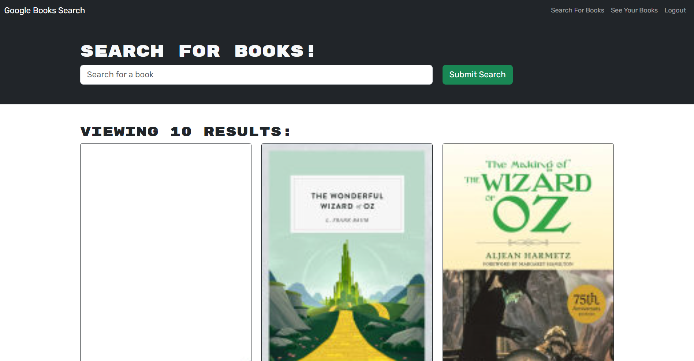
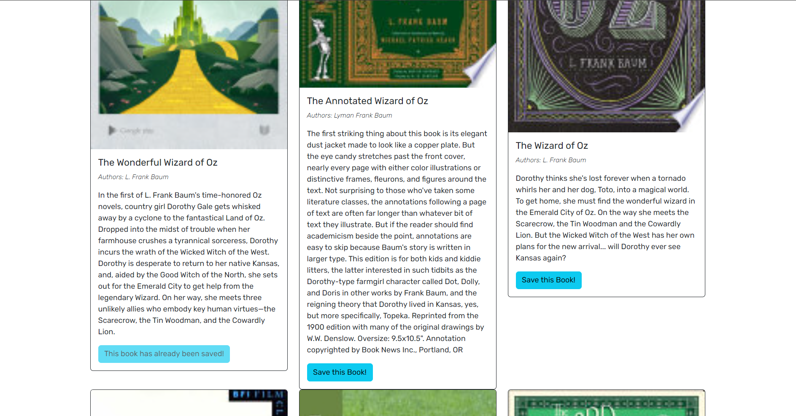

# Book-Search-Engine

## Table of Contents
- [Description](#description)
- [Features](#features)
- [Technologies Used](#technologies-used)
- [Installation](#installation)
- [Usage](#usage)
- [Deployment](#deployment)
- [Screenshots](#screenshots)
- [Contributing](#contributing)
- [License](#license)

## Description

The Book Search Engine is a full-stack MERN application that allows users to search for books via the Google Books API. This project is built using the Apollo Server to implement a GraphQL API. Users can sign up, log in, search for books, save their favorite books to their account, and access a list of their saved books. This application demonstrates the use of GraphQL with Apollo Server in a real-world scenario, replacing traditional RESTful API methods.

## Features

- **User Authentication**: Users can sign up and log in using their email and password.
- **Book Search**: Users can search for books using any keyword.
- **Save Books**: Logged-in users can save books to review or purchase later.
- **Manage Saved Books**: Users can view and delete books they have saved.

## Technologies Used

- **MongoDB**: A NoSQL database that stores data in flexible, JSON-like documents.
- **Express.js**: A web application framework for Node.js.
- **React**: A JavaScript library for building user interfaces.
- **Node.js**: A JavaScript runtime built on Chrome's V8 JavaScript engine.
- **GraphQL**: A query language for APIs and a runtime for fulfilling those queries with your existing data.
- **Apollo Server**: An open-source, spec-compliant GraphQL server that's compatible with any GraphQL schema.
- **GraphQL Playground**: Integrated GraphQL IDE for testing and viewing queries and mutations.

## Installation

1. Clone the repository to your local machine.
2. Navigate to the project directory and run `npm install` to install dependencies.
3. Ensure MongoDB is running on your machine.
4. To start the server, run `npm run develop` in the root directory.
5. Open a browser and navigate to `http://localhost:3000` to view the application.

## Usage

After launching the application:
- **Home Page**: The default search page allows users to enter search terms.
- **Sign Up/Login**: Users need to sign up or log in to save books or access their saved books.
- **Search and Save Books**: After logging in, users can save books from search results.
- **View Saved Books**: Users can view all books they have saved and remove them if desired.

## Deployment

- The application is deployed using Render with a MongoDB database hosted on MongoDB Atlas.
- View the live link of the application.
- [Live link]()

## Screenshots

- **Home Page**: Searching for books.

- **Saved Books**: Viewing saved books.

- **Delete a book**: Deleting a saved book.

## Contributing

Contributions are welcome. Please open an issue to discuss proposed changes or submit a pull request.

## License

This project is licensed under the MIT License.